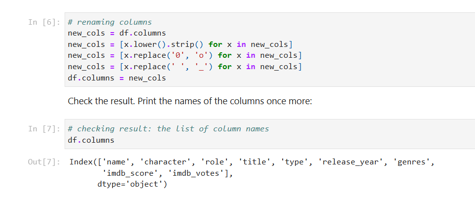
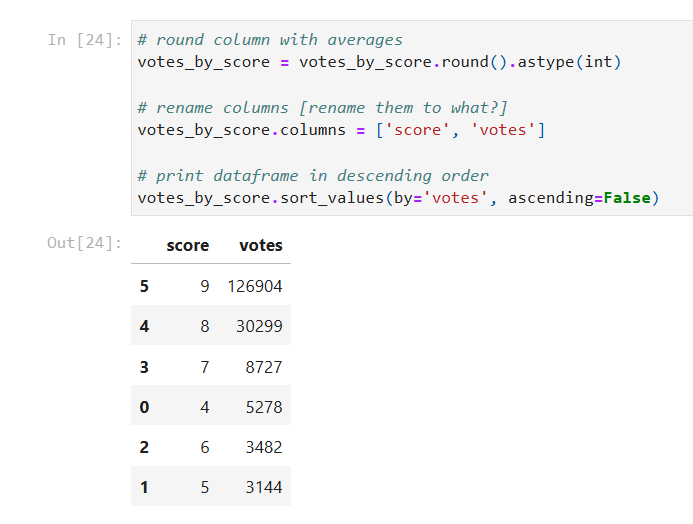

# Sprint 1 Project: Python Basics

---

## Project Overview

In this project, you will work with data from the entertainment industry. You will study a dataset with records on movies and shows. The research will focus on the “Golden Age” of television, which began in 1999 with the release of The Sopranos and is still ongoing.

The aim of this project is to investigate how the number of votes a title receives from IMDb users impacts its ratings. The assumption is that highly-rated shows (we will focus on TV shows, ignoring movies) released during the “Golden Age” of television also have the most votes.

This project is similar to the tasks you will be getting in your job as a data professional. Many business decisions are initially born as assumptions, your contribution as an expert in the data domain is to answer the question “Did the assumption formulated before the study appear to be true?”

---

## Conclusion

The research done confirms that highly-rated shows released during the "Golden Age" of television also have the most votes. While shows with score 4 have more votes than ones with scores 5 and 6, the top three (scores 7-9) have the largest number. The data studied represents around 94% of the original set, so we can be confident in our findings.

---

## Sample Outputs

Here are two key moments from the analysis:

  
*Renamed column headers for consistency and readability.*

 

  
*Average IMDb vote counts per score for TV shows released since 1999.*

---

📄 See the full analysis in [`sprint-01-project.ipynb`](./sprint-01-project.ipynb)  
📄 Or view a static version in [`sprint-01-project.html`](./sprint-01-project.html)  
📄 Project background: [`project-description.md`](./project-description.md)
